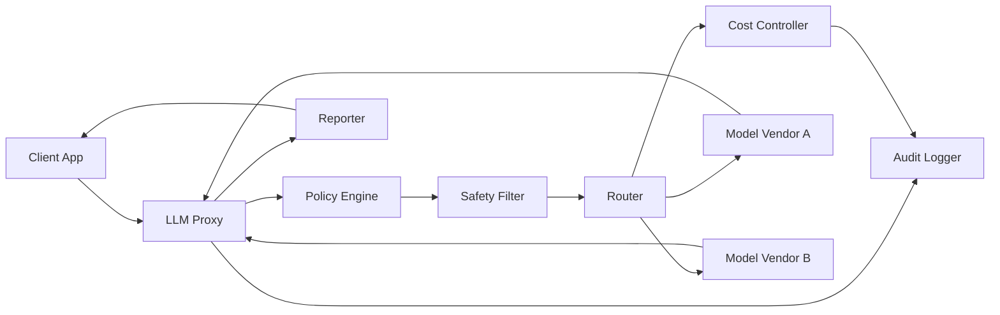
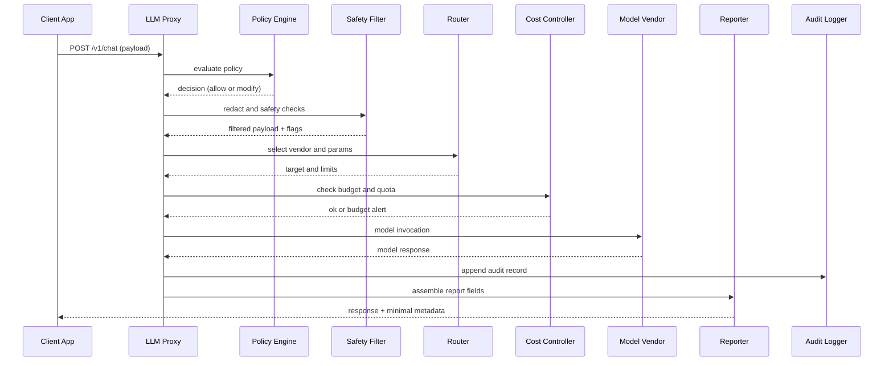

# AI Governance Dashboard — Architecture One-Pager

**Repo:** https://github.com/aurelius-in/AI-Governance  
**Contact:** oliveraellison@gmail.com • LinkedIn: https://www.linkedin.com/in/oellison/

Enterprise governance for AI systems with an LLM proxy, policies as code, safety guardrails, cost controls, vendor routing, and complete auditability. Focused on enforceable policy, predictable cost, and transparent operations.

---

## 1) Problem & Business Value

**Problem.** Organizations need to use AI safely and economically across teams and vendors, but lack consistent enforcement, cost visibility, and audit evidence.

**Value.**
- Enforce policy at the gateway: data handling, redaction, model access, and action allow lists
- Control spend with per tenant budgets, quotas, and usage telemetry
- Route requests to the most suitable model or vendor by policy and cost
- Provide audit ready traces and reports for compliance and security teams

---

## 2) Agent Architecture & Orchestration

**Roles.**

| Component | Purpose | Key Inputs | Key Outputs |
|---|---|---|---|
| **LLM Proxy** | Entry point for client traffic | Requests, tools, credentials | Normalized calls, context |
| **Policy Engine** | Enforce policies as code | OPA rules, tenant config | Allow, deny, or modify decisions |
| **Safety Filter** | Redaction and safety checks | Content, PII detectors | Filtered content, flags |
| **Router** | Vendor and model selection | Policies, price tables, SLAs | Target selection and parameters |
| **Cost Controller** | Budgets, quotas, metering | Usage, price sheets | Budget checks, alerts |
| **Reporter** | Human readable summaries | Trace data, metrics | Reports and dashboards |
| **Audit Logger** | Immutable evidence | Requests, decisions, results | Audit records |
| **Orchestrator** | Deterministic flow | All of the above | Trace IDs and outcomes |

**Orchestration (Mermaid).**

---

## 3) Data Flow & Storage

- **APIs:** FastAPI services (`/v1/chat`, `/policy/evaluate`, `/safety/redact`, `/route`, `/usage`, `/report`)
- **Admin UI:** React and TypeScript console for policies, budgets, and routing tables
- **Stores**
  - **PostgreSQL:** tenants, policies, budgets and quotas, routes, service accounts, audit trail
  - **Redis:** rate limits, token buckets, short lived state
  - **Object store:** exports (CSV, JSON, PDF) and large audit artifacts
  - **Optional vector index:** prompt templates and knowledge snippets
- **Observability:** OpenTelemetry traces; Prometheus metrics; Grafana dashboards

**Sequence (request evaluation).**

---

## 4) Safety, Privacy, & Governance

- **Policies as code:** OPA rules gate data egress, tool usage, and vendor selection
- **Redaction pipeline:** pattern and semantic redaction before vendor calls; PII flags persisted
- **Access and isolation:** tenant isolation, scoped tokens, per environment keys
- **Compliance:** logging for SOX like controls, HIPAA awareness, GDPR data rights workflows
- **Security:** KMS backed secret management; allow lists for tools and outbound hosts
- **Explainability:** per request rationale for policy hits and routing decisions

---

## 5) Deployability & Ops Notes

- **Stack:** FastAPI, React and TypeScript, PostgreSQL, Redis, OPA
- **Packaging:** Docker images; Helm chart for Kubernetes
- **CI/CD:** GitHub Actions with policy tests, redaction tests, and contract tests
- **Scaling:** stateless proxy with HPA; Redis for rate limits; partitioned audit tables
- **SLOs:** proxy latency p95, policy evaluation time, redaction time, error rate
- **Cost management:** price sheets per vendor, tagging, alert thresholds, budget reset cadence

---

## Walkthrough: Policy to Response

1. Request arrives at the LLM Proxy and is normalized.  
2. Policy Engine evaluates rules and either allows, modifies, or denies.  
3. Safety Filter performs redaction and records flags.  
4. Router selects a vendor and model based on policy and price.  
5. Cost Controller verifies budget and enforces quotas.  
6. Model call executes and returns the result.  
7. Reporter assembles minimal response metadata; Audit Logger stores the full trace.

---

## UI/UX Preview

  
  

---

## Quick Links

- **Source:** https://github.com/aurelius-in/AI-Governance
- **Portfolio hub:** https://github.com/aurelius-in/agentic-portfolio
