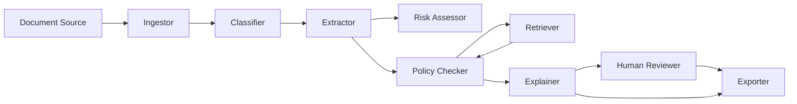
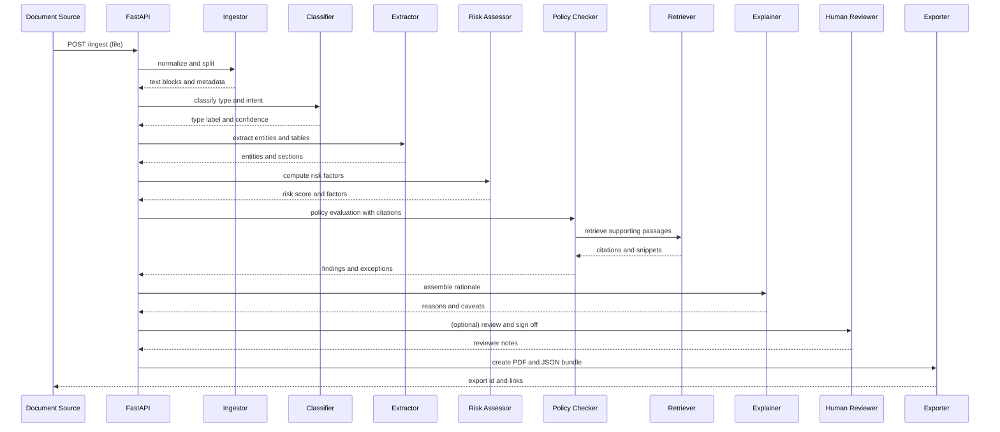

# AI Document Agent (aiDa) — Architecture One-Pager

**Repo:** https://github.com/aurelius-in/Smart-Document-Bot  
**Contact:** oliveraellison@gmail.com • LinkedIn: https://www.linkedin.com/in/oellison/

Multi‑agent document analysis for regulatory compliance and business intelligence. Ingests and classifies documents, extracts entities, assesses risk and policy alignment, and produces audit‑ready packets with traceable rationale.

---

## 1) Problem & Business Value

**Problem.** High volume, heterogeneous documents with mixed structure make it hard to find facts quickly, apply policy consistently, and maintain audit trails.

**Value.**
- Faster evidence gathering and policy checks with consistent outputs
- Transparent rationale with citations and versioned sources
- Reduced manual effort on repetitive review tasks, focus on edge cases
- Audit‑ready packets and exportable artifacts

---

## 2) Agent Architecture & Orchestration

**Agent roles.**

| Agent | Purpose | Key Inputs | Key Outputs |
|---|---|---|---|
| **Ingestor** | Collect and normalize files | PDFs, DOCX, emails, text | Text blocks, layout, metadata |
| **Classifier** | Identify doc type and intent | Content features, embeddings | Type label and confidence |
| **Extractor** | Capture entities, tables, dates | Text blocks, layout | Entities, relations, sections |
| **Risk Assessor** | Evaluate risk factors | Entities, policy signals | Risk score and factors |
| **Policy Checker** | Apply rules and thresholds | OPA rules, policy text | Findings, exceptions, required actions |
| **Retriever** | Ground answers in sources | Vector index, KB | Citations and snippets |
| **Explainer** | Assemble rationale | Trace, citations | Reasons and caveats |
| **Human Reviewer** | Optional approval and edits | Case packet | Notes and sign off |
| **Exporter** | Produce artifacts | Packet, templates | PDF and JSON bundle |
| **Orchestrator** | Deterministic flow | All of the above | Trace id and metrics |

**Orchestration (Mermaid).**

---

## 3) Data Flow & Storage

- **APIs:** FastAPI services (`/ingest`, `/classify`, `/extract`, `/risk`, `/policy`, `/explain`, `/export`)
- **Frontend:** React and TypeScript dashboard with queue, review panel, and trace view
- **Stores**
  - **PostgreSQL:** documents, entities, decisions, rule hits, audit trail, reviewer actions
  - **Redis:** queues, locks, short‑lived state
  - **Vector DB (ChromaDB or Pinecone):** embeddings for retrieval and similar documents
  - **Object store:** original files and export bundles
- **Observability:** OpenTelemetry traces; Prometheus metrics; Grafana dashboards

**Sequence (file to packet).**

---

## 4) Safety, Privacy, & Governance

- **PII/PHI controls:** field‑level encryption, TLS, and data minimization
- **Redaction pipeline:** semantic and pattern redaction before model or tool calls
- **Policies as code:** OPA rules gate findings, thresholds, and export eligibility
- **Explainability:** source citations for extracted facts and decisions
- **Auditability:** immutable logs of inputs, transformations, outputs, and actor actions
- **Access control:** RBAC with tenant isolation and short‑lived credentials

---

## 5) Deployability & Ops Notes

- **Stack:** FastAPI, React and TypeScript, PostgreSQL, Redis, ChromaDB or Pinecone
- **Packaging:** Docker images; Helm chart for Kubernetes
- **CI/CD:** GitHub Actions with unit, contract, and redaction tests
- **Scaling:** stateless APIs with HPA; partitioned tables for large document sets
- **SLOs:** ingest to first result latency, reviewer touch‑time, export latency
- **Model management:** versioned extractors and thresholds with drift alerts

---

## Walkthrough: Representative Flow

1. Upload a document through the dashboard or API.  
2. Ingestor normalizes the file and captures layout metadata.  
3. Classifier sets the document type and intent.  
4. Extractor records entities and sections.  
5. Risk Assessor computes risk factors.  
6. Policy Checker evaluates rules with supporting citations.  
7. Explainer assembles rationale; Human Reviewer can sign off.  
8. Exporter produces a PDF and JSON bundle for downstream systems.

---

## UI Previews (GIF/PNG)

  
  

  
  

---

## Quick Links

- **Source:** https://github.com/aurelius-in/Smart-Document-Bot
- **Portfolio hub:** https://github.com/aurelius-in/agentic-portfolio
