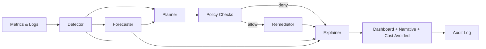
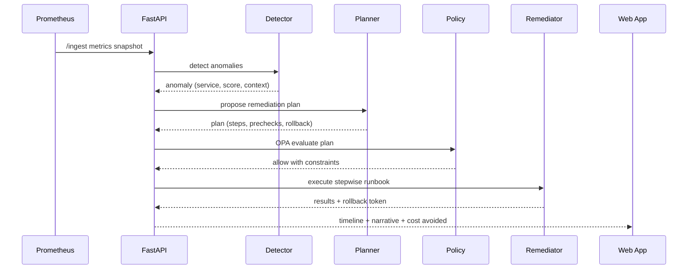

# AutoOps Sentinel — Architecture One-Pager

##### **Repo:** https://github.com/aurelius-in/AutoOps-Sentinel  

##### **Contact:** oliveraellison@gmail.com • LinkedIn: https://www.linkedin.com/in/oellison/

Agentic AIOps that ingests metrics and logs, detects anomalies, forecasts incident risk, and executes safe auto-remediation via policy-driven runbooks. Includes exec-ready narratives that explain actions and quantify cost avoided.

---

## 1) Problem & Business Value

**Problem.** Ops teams drown in noisy alerts and manual runbooks, reacting late to incidents and SLO burn.

**Value.**
- Fewer pages and faster MTTR through proactive detection and guided auto-remediation
- Predictive visibility into risk and SLO burn to prevent outages
- Clear business translation of technical events into cost avoided and impact on availability
- Strong guardrails so automation is safe, auditable, and reversible

---

## 2) Agent Architecture & Orchestration

**Agent roles.**

| Agent | Purpose | Key Inputs | Key Outputs |
|---|---|---|---|
| **Detector** | Spot anomalies and regressions | Metrics, logs, baselines | Anomaly events with score and context |
| **Forecaster** | Predict incident risk and SLO burn | Recent metrics, seasonality | Risk horizon, burn estimate, confidence |
| **Planner** | Choose best remediation path | Events, policies, runbook catalog | Candidate plan with steps and prechecks |
| **Remediator** | Execute safe actions with guardrails | Plan, RBAC, approvals | Action results, rollback tokens |
| **Explainer** | Exec-friendly narrative and cost math | Events, actions, SLOs, rate cards | Storyboard: what happened, why, value |
| **Policy** | OPA policy checks and constraints | Runbook metadata, env rules | Allowed actions, blocked steps, justifications |
| **Orchestrator** | Route between agents and tools | All of the above | Deterministic graph execution and audit IDs |

**Orchestration (Mermaid).**

---

## 3) Data Flow & Storage

- **APIs:** FastAPI services (`/ingest`, `/detect`, `/forecast`, `/plan`, `/remediate`, `/report`)
- **Frontend:** React + TypeScript (MUI) with timelines, SLO gauges, and action history
- **Stores**
  - **PostgreSQL:** incidents, anomalies, actions, SLO budgets, cost models, runbook catalog
  - **Redis:** queues, locks, rate limits, short-lived state
  - **Prometheus:** metric source and SLO queries; Grafana dashboards for ops
  - **Object store:** PDF and JSON exports for exec reports and audit bundles
- **Observability:** OpenTelemetry traces, Prometheus metrics, Grafana panels
- **Runbooks:** YAML runbooks referencing tools (Kubernetes, Docker, systemd, HTTP hooks)

**Sequence (from anomaly to fix).**

---

## 4) Safety, Privacy, & Governance

- **RBAC and approvals:** environment and blast-radius based permissions, optional human approval gates
- **Prechecks and dry-runs:** health checks, canary rollout, backoff and circuit break
- **Policies-as-code:** OPA rules for what, where, and when automation is allowed
- **Scoped credentials:** short-lived tokens for Kubernetes, Docker, or SSH actions
- **Audit trail:** immutable log of inputs, decisions, policies hit, commands, results, and rollbacks
- **Data handling:** metrics and logs treated as operational data with PII redaction hooks where needed

---

## 5) Deployability & Ops Notes

- **Stack:** FastAPI, Python, React/TypeScript (MUI), PostgreSQL, Redis, Prometheus, Grafana
- **Packaging:** Docker images per service; Helm chart for Kubernetes
- **CI/CD:** GitHub Actions for lint, tests, image build, chart release
- **Config:** .env and secrets manager for DB, Redis, API keys, policy toggles
- **Scaling:** stateless APIs with HPA; Redis for coordination; partitioned tables for large event volumes
- **SLOs:** latency p95, incident MTTA/MTTR, false positive rate, automation success rate, cost avoided

---

## 6) Walkthrough: Core Flow and Outcomes (about 90 seconds)

1. **Live view.** Show service dashboard with SLO budget and key metrics.
2. **Anomaly detected.** A spike appears in error rate. The **Detector** flags an anomaly with score and context.
3. **Forecast risk.** The **Forecaster** panel predicts SLO burn in 27 minutes with confidence and a small chart.
4. **Plan proposed.** The **Planner** recommends: scale replicas + throttle noisy job + clear stuck queue. Prechecks shown inline.
5. **Policy gate.** Click **Evaluate** to show OPA results and why actions are allowed in staging but guarded in prod.
6. **Execute runbook.** Run the plan. Watch stepwise logs and a rollback token appear.
7. **Narrative and value.** The **Explainer** generates an exec narrative with cost avoided and links to evidence.
8. **Export.** One click to export a PDF and JSON bundle for the post-incident review.

**Wow moments**
- Side-by-side anomaly, forecast, and proposed fix with guardrails
- Real-time runbook execution with human-readable steps and instant rollback
- Cost avoided calculation tied to SLO impact and rate cards
- Clean PDF export that reads like an exec brief

---

## Screenshots

  
  

  

---

## Quick Links

- **Source:** https://github.com/aurelius-in/AutoOps-Sentinel
- **Portfolio hub:** https://github.com/aurelius-in/agentic-portfolio
