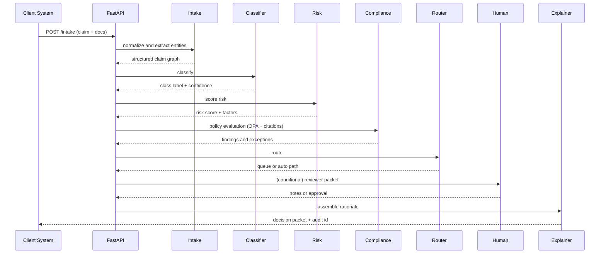

# Agentic Claims Triage AI — Architecture One-Pager

**Repo:** https://github.com/aurelius-in/Claims-Triage-AI  
**Contact:** oliveraellison@gmail.com • LinkedIn: https://www.linkedin.com/in/oellison/

Agent‑driven decision support for insurance and healthcare claims: intake, classification, risk scoring, compliance checks, routing, and audit‑ready explanations. Built for consistency, traceability, and safe human‑in‑the‑loop operation.

---

## 1) Problem & Business Value

**Problem.** High claim volume, inconsistent adjudication, and fragmented rules create long cycle times, leakage, and compliance exposure.

**Value.**
- Faster, more consistent decisions with transparent rationale
- Early risk identification for special handling or SIU review
- Policy alignment and auditability by default
- Human reviewers focus on edge cases, not routine work

---

## 2) Agent Architecture & Orchestration

**Agent roles.**

| Agent | Purpose | Key Inputs | Key Outputs |
|---|---|---|---|
| **Intake** | Normalize claim payloads and documents | EDI/JSON, PDFs, history | Structured claim entity graph |
| **Classifier** | Assign claim type/severity | Intake graph, embeddings | Class label + confidence |
| **Risk Scorer** | Assess fraud/complexity exposure | Features, signals, network | Risk score + factors |
| **Compliance (Policy)** | Apply coverage and policy rules | Plan, policy text, OPA rules | Findings, exceptions, required docs |
| **Evidence Retriever** | Retrieve guidelines and precedents | KB, policy, similar claims | Citations and excerpts |
| **Router** | Route to queue or auto‑adjudication | Class, risk, compliance | Queue selection, SLAs |
| **Explainer** | Produce human‑readable rationale | Full trace | Reasons, caveats, links |
| **Human Reviewer** | Optional approval/edits | Case packet | Final decision notes |
| **Orchestrator** | Deterministic graph execution | All of the above | Trace ID, metrics |

**Orchestration (Mermaid).**

```mermaid
flowchart LR
  SUB[Submission] --> INT[Intake]
  INT --> CLS[Classifier]
  INT --> RSV[Risk Scorer]
  CLS --> CMP[Compliance (Policy)]
  RSV --> CMP
  CMP --> EVI[Evidence Retriever]
  EVI --> CMP
  CMP --> ROU[Router]
  ROU -->|needs review| HUM[Human Reviewer]
  ROU -->|auto path| EXP[Explainer]
  HUM --> EXP
  EXP --> PKT[Decision Packet + Audit]
```

---

## 3) Data Flow & Storage

- **APIs:** FastAPI services (`/intake`, `/classify`, `/risk`, `/policy`, `/route`, `/explain`, `/audit`)
- **Frontend:** React + TypeScript dashboard with queues, case detail, explanations, and activity log
- **Stores**
  - **PostgreSQL:** claims, entities, decisions, rules hits, audit trail, reviewer actions
  - **Redis:** work queues, locks, short‑lived state
  - **Vector DB (ChromaDB/Pinecone):** policy/guideline embeddings and similar‑case search
  - **Object store:** document artifacts and exports (PDF, JSON)
- **Observability:** OpenTelemetry traces; Prometheus metrics; Grafana dashboards

**Sequence (claim to decision).**



---

## 4) Safety, Privacy, & Governance

- **PII/PHI controls:** field‑level encryption, TLS, minimization
- **Redaction:** semantic + pattern redaction before external model/tool calls
- **Policies‑as‑code:** OPA rules for eligibility, plan limits, and documentation requirements
- **Explainability:** SHAP factors, rule hits, and source citations
- **Audit:** immutable logs of inputs, features, outputs, and actor actions
- **Access:** RBAC, least‑privilege service accounts, time‑boxed review permissions

---

## 5) Deployability & Ops Notes

- **Stack:** FastAPI, Python, PostgreSQL, Redis, React/TypeScript
- **AI/ML:** XGBoost or LightGBM + SHAP; optional LLM retrieval for policy text
- **Packaging:** Docker images; Helm chart for Kubernetes
- **CI/CD:** GitHub Actions; unit + contract tests for rules and redaction
- **Scaling:** stateless APIs (HPA); partitioned tables for high claim volume
- **KPIs:** touch‑time, queue latency, agreement rate, appeal rate, false positive rate

---

## Walkthrough: Representative Flow

1. Intake normalizes the claim and documents to a structured graph.  
2. Classifier assigns claim type/severity with confidence.  
3. Risk Scorer adds risk factors for potential special handling.  
4. Compliance applies policy rules and records findings and exceptions.  
5. Router selects auto‑path or a review queue based on class, risk, and policy results.  
6. (If routed) Human Reviewer adds notes or adjustments.  
7. Explainer produces a decision packet with rationale, citations, and an audit reference.

---

## Screenshots

<p>
  
</p>

---

## Quick Links

- **Source:** https://github.com/aurelius-in/Claims-Triage-AI
- **Portfolio hub:** https://github.com/aurelius-in/agentic-portfolio
