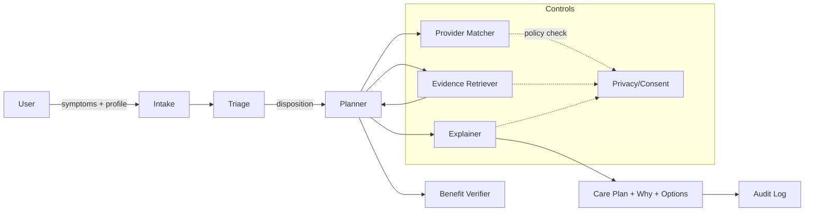
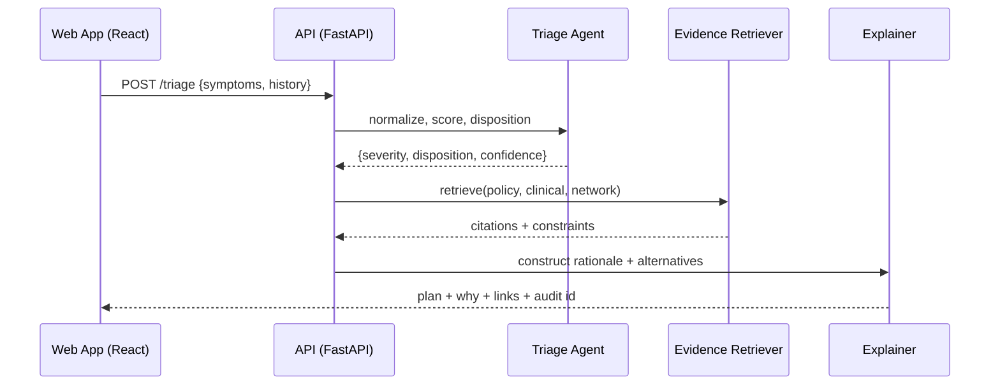

# Agentic AI Health Navigator — Architecture One-Pager

#### **Repo:** https://github.com/aurelius-in/AI-Health-Navigator-for-Patients  

#### **Contact:** oliveraellison@gmail.com • LinkedIn: https://www.linkedin.com/in/oellison/

A next-gen healthcare navigation platform that performs intelligent triage, provider matching, and personalized care recommendations using a multi-agent system with memory (episodic, semantic, long-term). Built to be demonstrably safe, explainable, and production-ready.

---

## 1) Problem & Business Value

**Problem.** Patients struggle to translate symptoms and benefits into the right next medical step, causing delays, ER overuse, and low satisfaction.

**Value.**
- Route to the right care the first time (lower avoidable cost, shorter time-to-care)
- Improve patient experience with clear “why” explanations and options
- Reduce clinician/agent load via self-service navigation and summary handoffs
- Enterprise-grade controls (auditability, privacy by design, observability)

---

## 2) Agent Architecture & Orchestration

**Agent roles (high level).**

| Agent | Purpose | Key Inputs | Key Outputs |
|---|---|---|---|
| **Intake** | Normalize symptoms & context | Free-text, forms, history | Structured case (ICD-like hints, risk flags) |
| **Triage** | Severity & urgency scoring | Intake case, clinical heuristics | Disposition (Urgent Care vs PCP vs ER) + confidence |
| **Evidence Retriever** | Grounded knowledge & benefits | KB, payer docs, provider directory | Citations, benefits, copays, constraints |
| **Planner** | Compose next-best actions | Triage + Evidence | Stepwise plan with alternatives |
| **Provider Matcher** | Find in-network providers | Directory, geo, availability | Ranked providers with fit rationale |
| **Benefit Verifier** | Coverage & pre-auth hints | Payer policy, member plan | Coverage summary, limits, pre-auth note |
| **Explainer** | Human-readable “why” | Full trace | Rationale, caveats, links |
| **Privacy/Consent** | PHI controls & redaction | Policy, consent | Enforced scopes, redacted payloads |
| **Orchestrator** | Tool & agent routing | All of the above | Deterministic agent graph execution |

**Orchestration (Mermaid).**

## 3) Data Flow & Storage

**APIs:** FastAPI services (/intake, /triage, /plan, /providers, /benefits, /explain)

**Frontend:** React + TypeScript SPA (session-scoped state, optimistic UI)

### State & stores

**PostgreSQL:** cases, user profiles (scoped), audit trails, provider directory

**Redis:** agent queues, short-lived sessions, rate limits

**Vector DB (ChromaDB):** policy/clinical embeddings for grounded retrieval

**Object store (optional):** artifacts (PDF plan, exports)

**Memory model:** episodic (per session), semantic (KB), long-term (opt-in user history)

**Telemetry:** OpenTelemetry export → Prometheus metrics → Grafana dashboards

### Sequence (triage request).

### 4) Safety, Privacy, & Governance

- **HIPAA-aware design:** PHI minimization, field-level encryption at rest (PostgreSQL), TLS in transit

- **Consent & scopes:** per-feature toggles (history, sharing with provider), explicit revocation

- **Redaction pipeline:** regex + semantic redaction prior to model/tool calls

- **Policies-as-code:** OPA checks for data egress, provider filtering, and action eligibility

- **Explainability:** every recommendation includes sources, confidence, and caveats

- **Auditability:** immutable audit log (actor, input hash, outputs, models/tools used)

- **Abuse & safety guardrails:** prompt hardening, function allow-lists, rate limiting, PII leak tests

### 5) Deployability & Ops Notes

- *Stack:* FastAPI, React/TypeScript, PyTorch, PostgreSQL, Redis, ChromaDB

- *Packaging:* Docker images per service; Helm chart for k8s

- *Config:* .env / Secrets Manager (DB, Redis, model keys, policy switches)

= *Scaling:* stateless APIs (HPA), Redis for coordination, DB read replicas for heavy reads

- *Observability:* Prometheus (SLOs, latency p95/p99), Grafana dashboards, OTEL traces

- *Env matrix:* dev (mock payers/providers), staging (synthetic members), prod

- *Testing:* contract tests for tools; redaction & policy unit tests; synthetic E2E

- *Cost controls:* per-agent quotas, caching, retrieval windows, batch inference options

### 6) Demo Script & “Wow” Moments (≈90 seconds)

- Symptom intake. Type “fever, sore throat, 2 days, mild cough.” See structured case appear live.

- Triage result. System returns “See PCP or Urgent Care within 24–48h,” with confidence and why.

- Provider matching. Show in-network providers near Austin, TX with rationale badges (distance, rating, fit).

- Benefits check. Surface copay/coverage summary and any pre-auth hints for tests (e.g., strep).

- Explainability. Click Why to open the decision trace with citations and user-friendly language.

- Personalization. Toggle “Penicillin allergy” and watch the plan update and the What changed diff.

- Export & handoff. Click Share Plan → generates a PDF summary + ICD-style hints and provider contact.
 
**Other Features:**

- Live agent trace with citations and confidence
- Instant diff when user context changes (allergy, pregnancy, age)
- Zero-leak redaction banner shows PHI controls are active
- One-click, exec-friendly PDF

### Screenshots

   
 
  

Quick Links

**Source:** https://github.com/aurelius-in/AI-Health-Navigator-for-Patients

**Portfolio hub:** https://github.com/aurelius-in/agentic-portfolio
