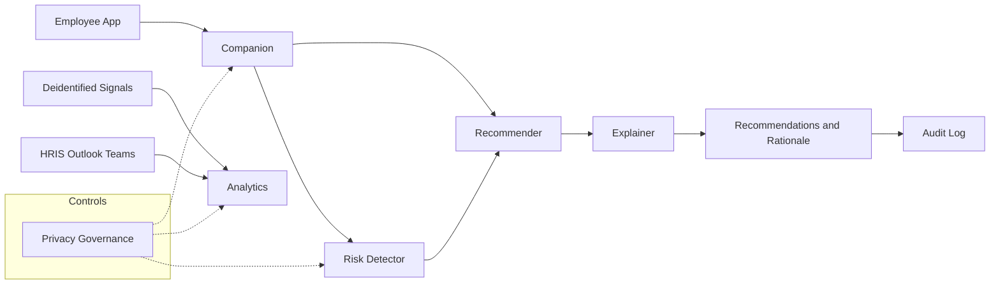
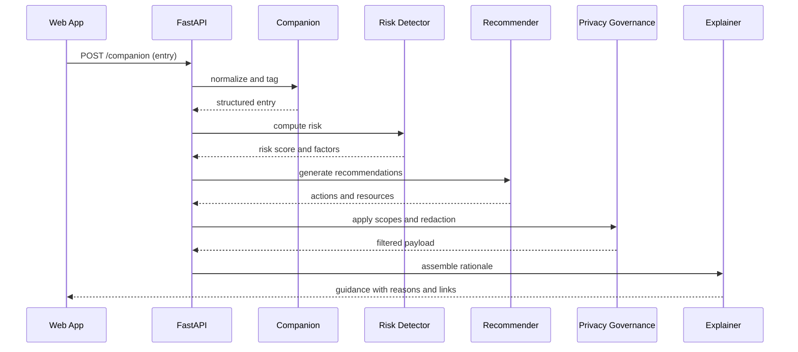

# Enterprise Wellness AI (MindTrace) — Architecture One-Pager

**Repo:** https://github.com/aurelius-in/MindTrace  
**Contact:** oliveraellison@gmail.com • LinkedIn: https://www.linkedin.com/in/oellison/

Enterprise wellness platform with a five agent architecture for organizational health: Companion, Recommendation, Risk Detection, Analytics, and Privacy Governance. Focused on privacy first insights, burnout risk detection, and practical recommendations for individuals and leaders.

---

## 1) Problem & Business Value

**Problem.** Organizations struggle to measure well being reliably while protecting privacy. Signals are fragmented across tools and self reports, and insights often arrive too late to be actionable.

**Value.**
- Earlier identification of burnout and workload risks
- Private by design support for individuals with optional sharing controls
- Aggregate analytics for teams and leaders without exposing personal data
- Clear governance, auditability, and deployability for enterprise environments

---

## 2) Agent Architecture & Orchestration

**Agent roles.**

| Agent | Purpose | Key Inputs | Key Outputs |
|---|---|---|---|
| **Companion** | Lightweight journaling and guidance | Self reports, context | Structured entries, intents |
| **Risk Detector** | Estimate stress and burnout risk | Journals, usage signals | Risk scores and factors |
| **Recommender** | Suggest actions and resources | Risk, goals, policies | Personalized recommendations |
| **Analytics** | Aggregate and trend analysis | De identified metrics | Team and org insights |
| **Privacy Governance** | Apply privacy and policy rules | Consent, org policy | Scopes, redaction, approvals |
| **Explainer** | Human readable rationale | Trace, citations | Reasons and caveats |
| **Orchestrator** | Route tools and agents | All of the above | Deterministic execution and audit ids |

**Orchestration (Mermaid).**

---

## 3) Data Flow & Storage

- **APIs:** FastAPI services (`/companion`, `/risk`, `/recommend`, `/analytics`, `/consent`, `/export`)
- **Frontend:** React and TypeScript with personal view, manager view, and compliance view
- **Stores**
  - **PostgreSQL:** user ids and scopes, opt in history, org config, risk and recommendation records
  - **Redis:** sessions, queues, rate limits
  - **Vector DB (ChromaDB or Pinecone):** guidance snippets and policy passages
  - **Time series source:** Prometheus or warehouse for operational signals as configured
  - **Object store:** exports and artifacts
- **Telemetry:** OpenTelemetry traces, Prometheus metrics, Grafana dashboards

**Sequence (journal to guidance).**

---

## 4) Safety, Privacy, & Governance

- **Privacy first design:** opt in by feature, clear scopes, and user visible controls
- **De identification:** separation of identifiers, redaction prior to model calls, minimal retention
- **Policies as code:** OPA checks for access, aggregation thresholds, and export rules
- **Compliance:** support for HIPAA awareness, GDPR rights, and SOC2 controls
- **Auditability:** immutable logs for access and changes with exportable evidence
- **Access controls:** RBAC, tenant isolation, short lived credentials

---

## 5) Deployability & Ops Notes

- **Stack:** FastAPI, React and TypeScript, PostgreSQL, Redis, ChromaDB or Pinecone
- **Packaging:** Docker images; Helm chart for Kubernetes
- **CI/CD:** GitHub Actions with tests and security scans
- **Scaling:** stateless APIs with HPA; partitioned tables for org scale
- **SLOs:** personal request latency, aggregation job latency, data subject request turnaround
- **Model management:** monitored thresholds for drift and recalibration windows

---

## Walkthrough: Representative Flow

1. A user records a brief journal entry or taps a check in.  
2. Companion normalizes the input and records structured fields.  
3. Risk Detector computes a score and contributing factors.  
4. Recommender proposes simple actions and resources aligned to policy.  
5. Privacy Governance applies scopes and redaction before anything is persisted or shared.  
6. Explainer provides plain language reasons and optional citations.  
7. Aggregates update in Analytics without exposing individual entries.

---

## UI/UX Preview

  

---

## Quick Links

- **Source:** https://github.com/aurelius-in/MindTrace
- **Portfolio hub:** https://github.com/aurelius-in/agentic-portfolio
